# Note 240611

## 学习一个东西 一定都要去看官网
- 如果官网 解释的不是很清楚 ,那就先用起来

### Build 的方式
- 

### Maven
- 官方下载地址 https://maven.apache.org/download.cgi
- 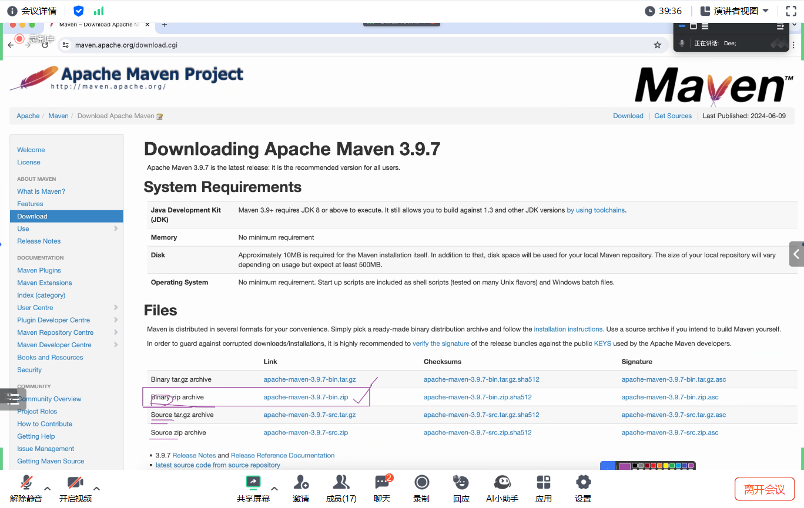
- 下载验证 是否是原官网的文件
  - 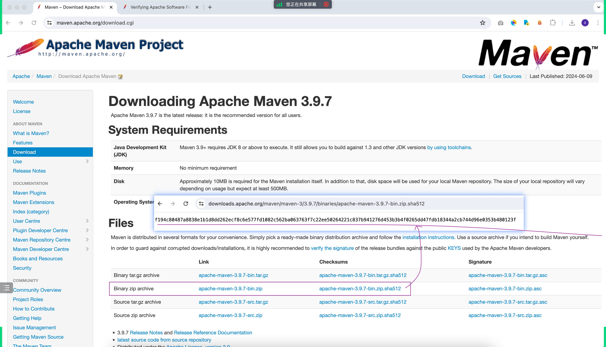
- 设置成全局访问
  - 获取 Maven 文件夹下的 bin 的路径 然后去配置环境变量
  - 配置环境变量
  - 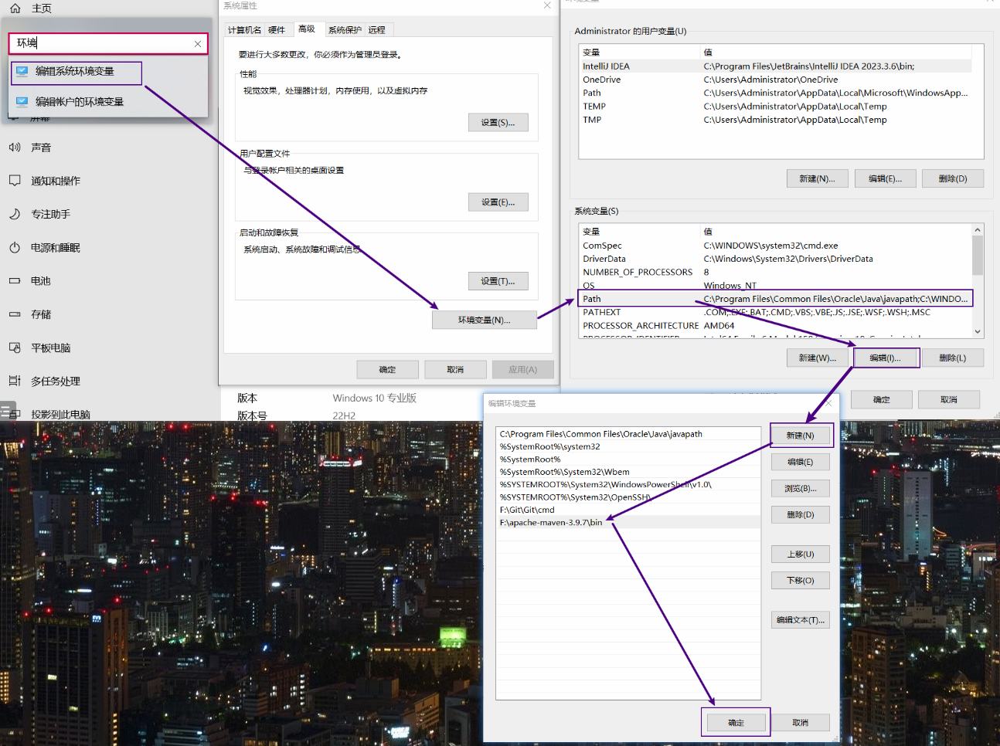
  - 验证 是否配置成功
    - 打开黑窗口 输入 mvn --version

### 注意 要把 setting.xml 加载进 .m2 文件夹
- 我的位置  C:\Users\Administrator\.m2

### 创建 Build system 为 Maven 的项目
- 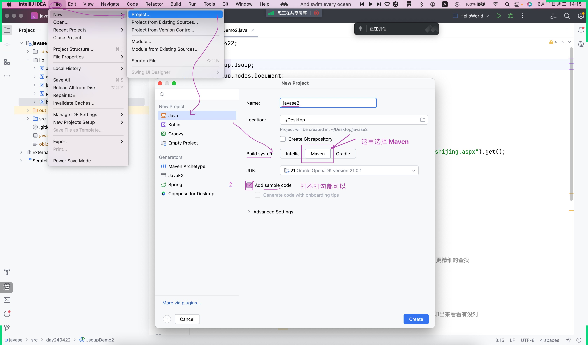

### 用 Git 创建 SSH 公钥
- 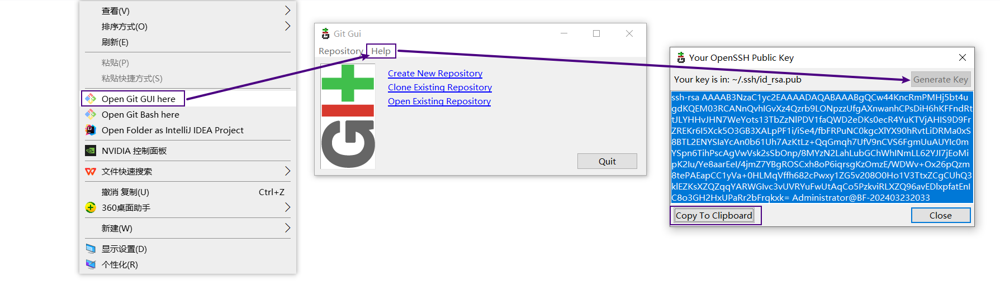

### 更改远程仓库的提交路径
- 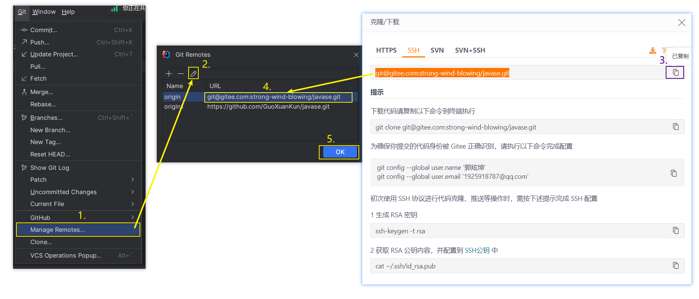

### 依赖仓库
- https://mvnrepository.com/

### 导依赖
- 导 Jsoup
  - 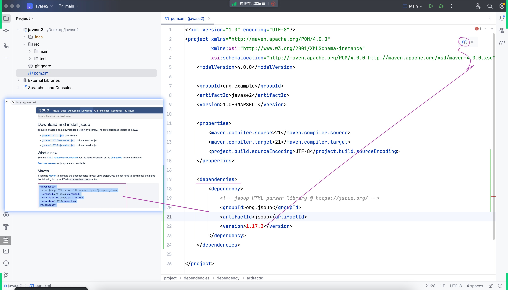
  - 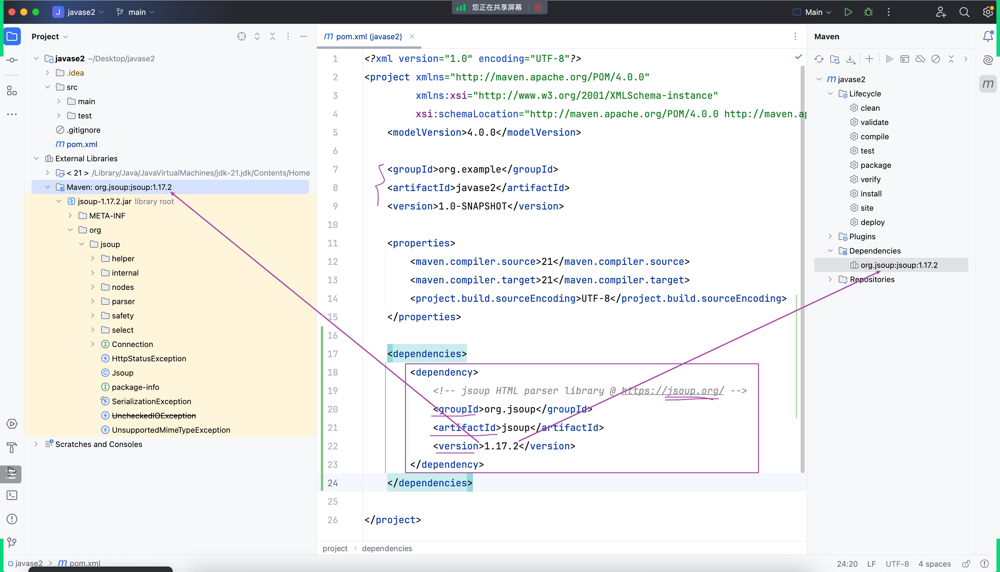
- 导 发邮件 的依赖
  - 其实只要导一个
  - 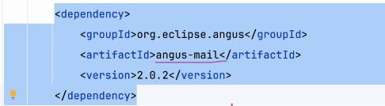

### GAV
- 注意要在 dependencies 里面导
- 唯一定位
- 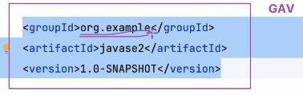
- 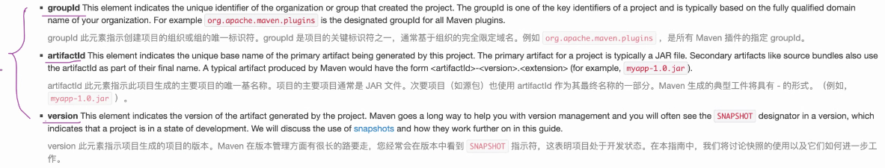

### 专业三件套
- 远程代码仓库
- 个人简历
- 个人网站