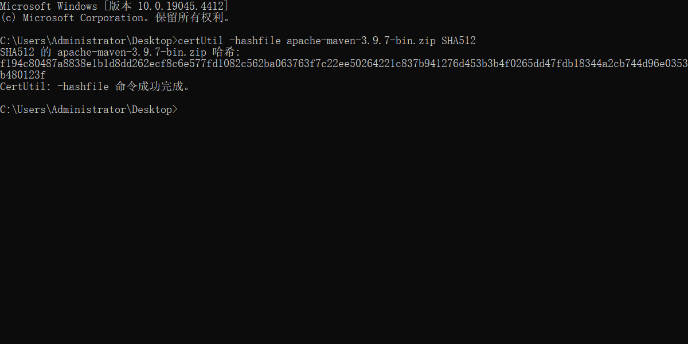

# Note 240611

### 之前的第三方包管理方式及问题
- 
- 
- 问题 :
  需要自己主动去下载 jar 包，自己添加到项目
  从远程仓库重新 clone 之后，忘记点击 Add as Library
  比如邮件发送需要的 jar 包不止一个、多个版本的匹配问题
  远程仓库除了 Java 源代码，还需要存储 jar 包
  jar 包版本更新的时候，需要重复操作一遍完整过程
  等等...

### 学习一个东西 一定都要去看官网
- 如果官网 解释的不是很清楚 ,那就先用起来

### Build 的方式
- 

### Maven
- 官方下载地址 https://maven.apache.org/download.cgi
- 
- 下载验证 是否是原官网的文件
  - 
  - 
  - 
- 设置成全局访问
  - 获取 Maven 文件夹下的 bin 的路径 然后去配置环境变量
  - 配置环境变量
  - 
  - 验证 是否配置成功
    - 打开黑窗口 输入 mvn --version
    - 
    - 

### 通过命令行的方式创建 Maven 项目（可以完全脱离 IDEA 编辑器）
- 
- mvn archetype:generate -DgroupId=com.mycompany.app -DartifactId=my-app -DarchetypeArtifactId=maven-archetype-quickstart -DarchetypeVersion=1.4 -DinteractiveMode=false
  - 
- 镜像加速 setting.xml
  - 
- 加速后
  - 
- 打开 pom.xml 截图中的内容修改成匹配自己电脑的 JDK 版本
  - 
- 执行以下命令
  - cd my-app
    mvn package
    java -cp target/my-app-1.0-SNAPSHOT.jar com.mycompany.app.App
  - 

### 镜像加速 setting.xml
- 注意 要把 setting.xml 加载进 .m2 文件夹
- 我的位置  C:\Users\Administrator\.m2

### 创建 Build system 为 Maven 的项目
- 
- 
- Maven 的理解
  - 
  - 

### 在远程创建一个新的仓库存储新创建的 Maven 项目
- 

### 配置 Gitee 免密登录
- https://help.gitee.com/base/account/SSH%E5%85%AC%E9%92%A5%E8%AE%BE%E7%BD%AE
- 用 Git 创建 SSH 公钥
  - 
  - 
- HTTPS -> SSH
  将之前已经 clone 到本地的，关联了 https 协议的仓库改成关联免密登录的 git 协议地址
  - 

### 更改远程仓库的提交路径
- 

### 依赖仓库
- https://mvnrepository.com/

### 导依赖
- 导 Jsoup
  - 
  - 
  - 
  - 
- 导 发邮件 的依赖
  - 其实只要导一个
  - 
  - 

### GAV
- 注意要在 dependencies 里面导
- 唯一定位
- 
- 

### 专业三件套
- 远程代码仓库
- 个人简历
- 个人网站