# Note 240612

## Review

### 开始准备
- 域名 目前可以做GroupId
  - 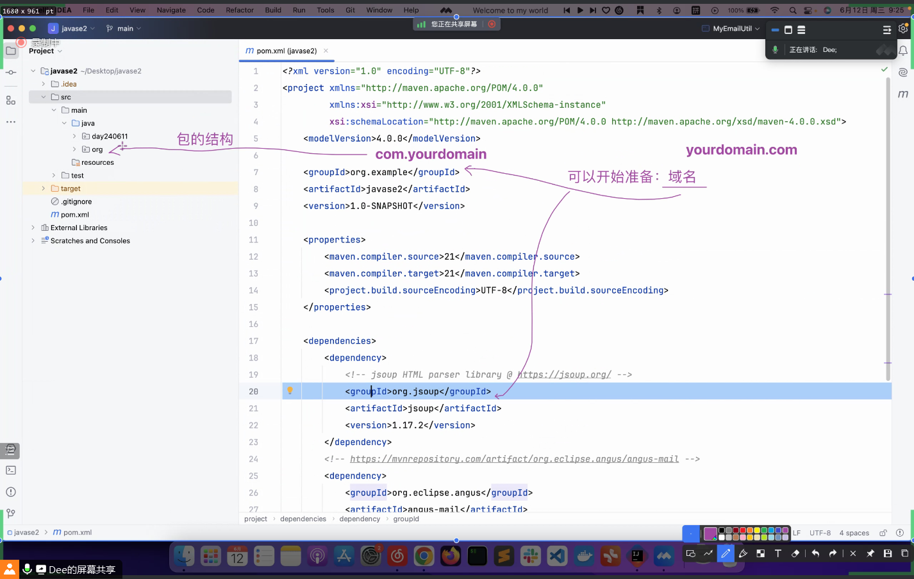

### lombok
- 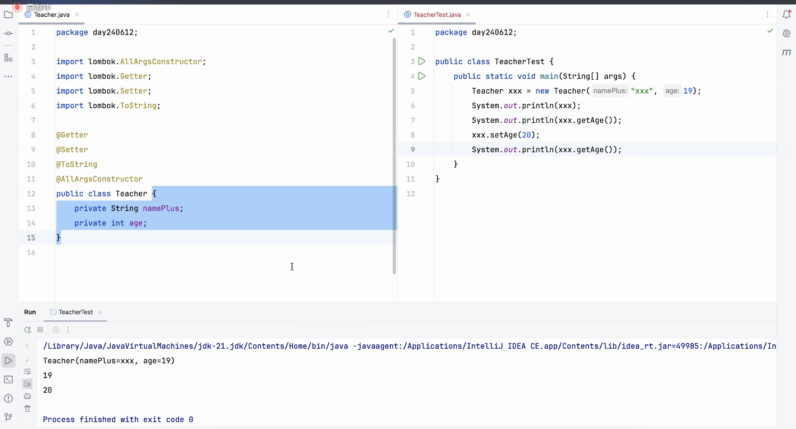
- 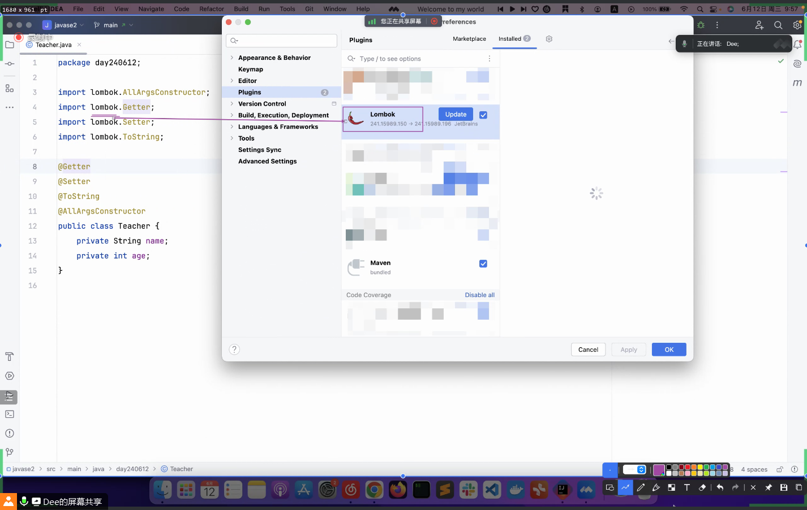
- 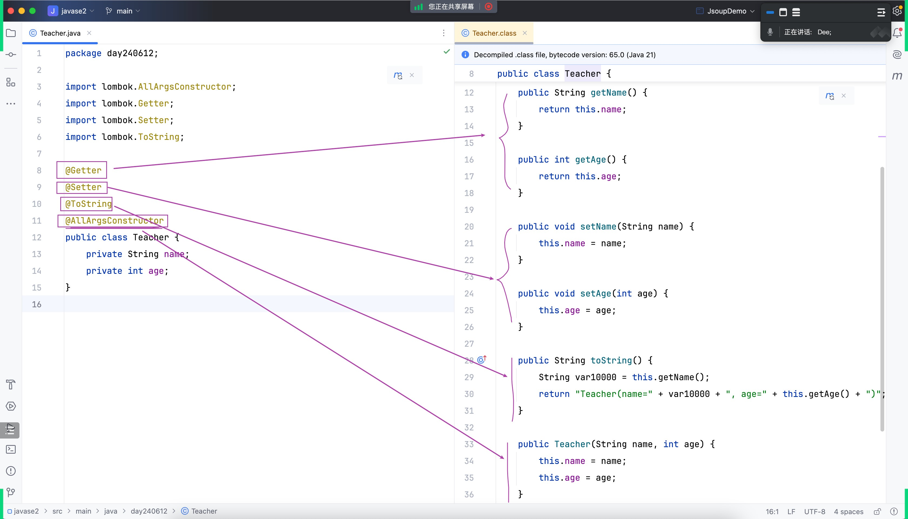
- 背后的点
  - 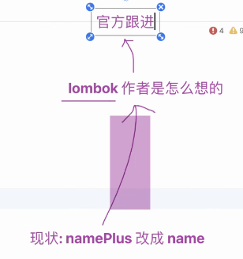

### 单元测试
- Keep your bar green , Keep your code clean
- 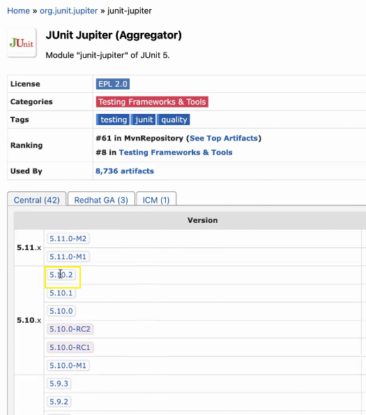
- 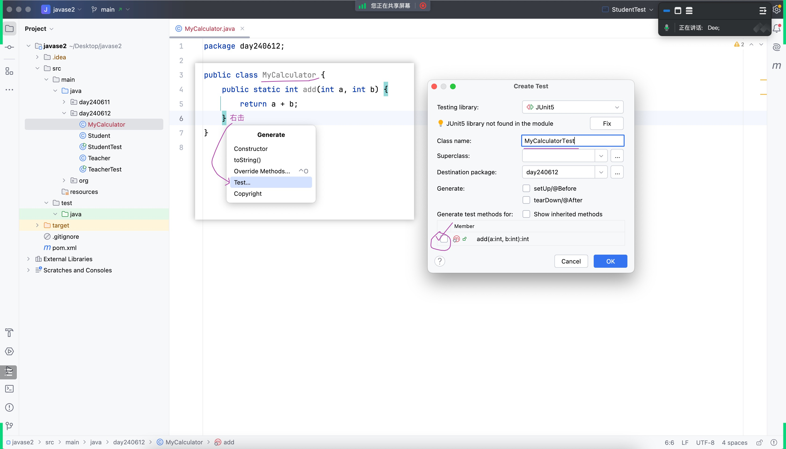
- 
- asserEquals()
  - 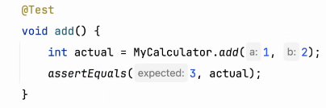
- 时间上的消耗不一样
  - 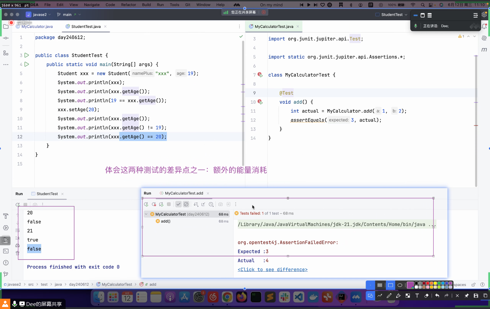
- .jar 包不会生成
  - 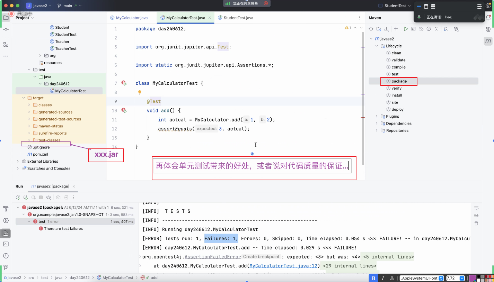
- 融入一些思想
  - 以终为始

### 储存
- 内存
- 文件
- 专业的存储软件

### 主流数据库软件
- 排名 : https://db-engines.com/en/ranking

### MySQL
- 官网 : https://www.mysql.com/
- 下载 MySQL
  - 下载完应该做校验
    - certUtil -hashfile filename MD5
  - 我的路径
    - 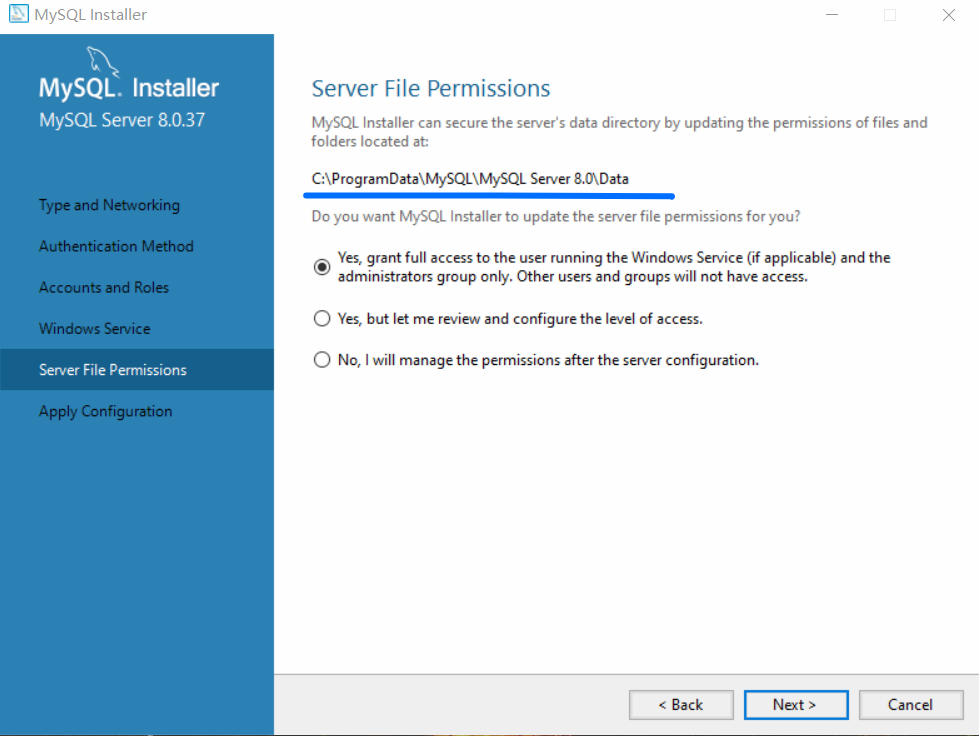
- 什么是 MySQL
  - 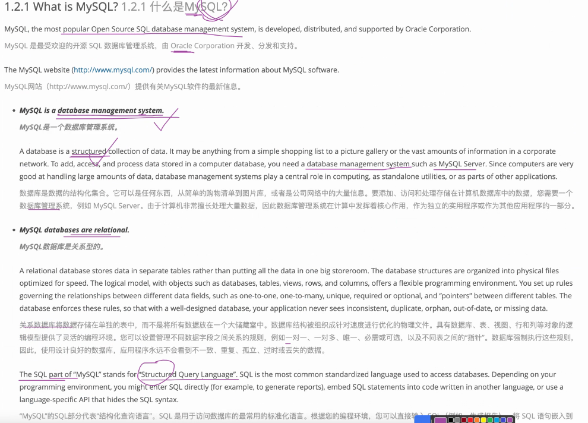
- MySQL 的发音
  - 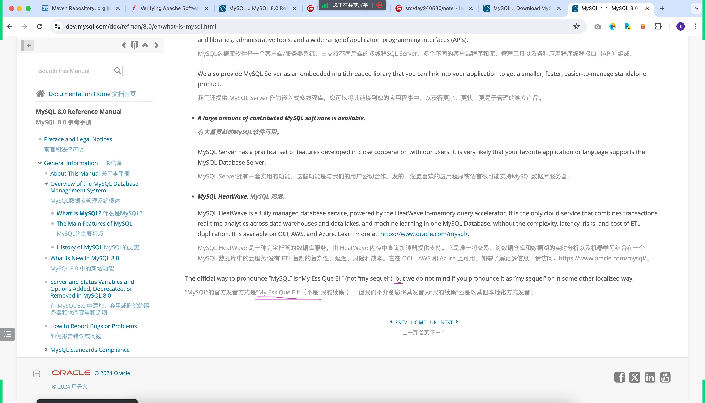

### Maven 之 生命周期
- 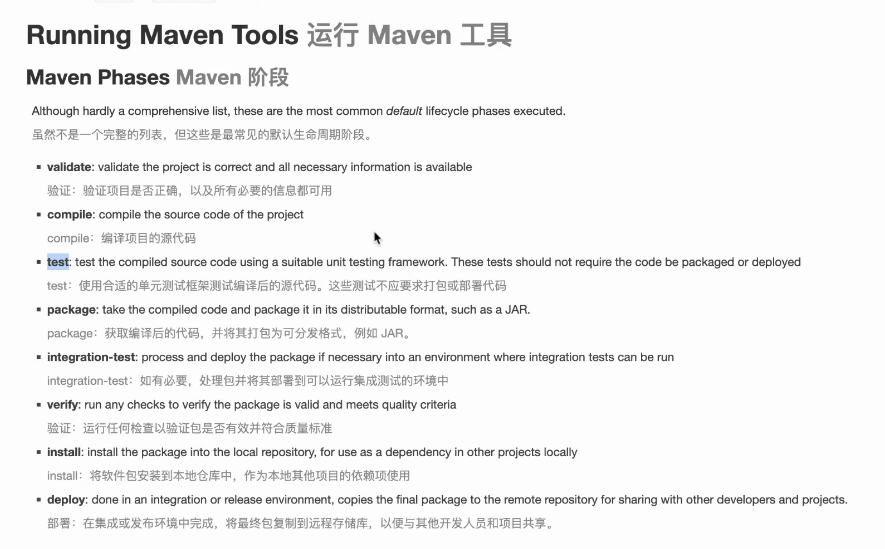

### 多视角看代码
- .java
- .class