# Note 240612

## Review

### 开始准备
- 域名 目前可以做GroupId
  - 

### lombok
- 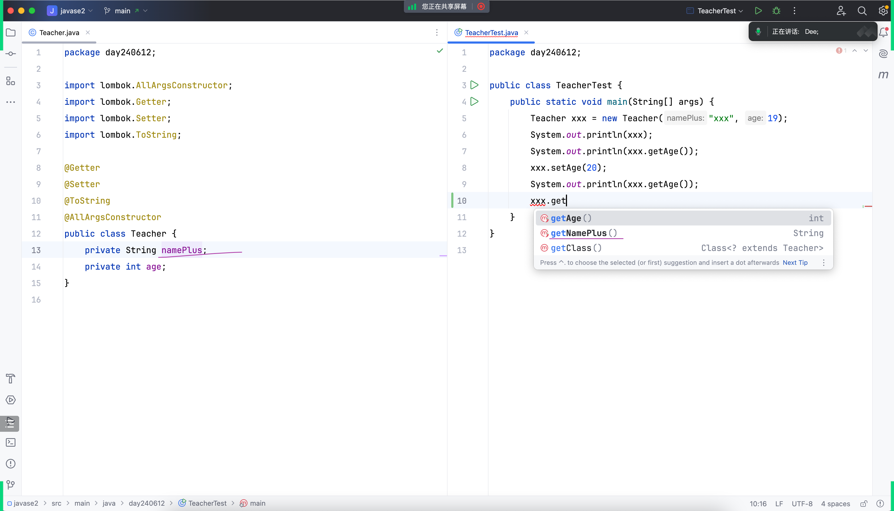
- 
- 
- 
- 背后的点
  - 

### 单元测试
- Keep your bar green , Keep your code clean
- 
- 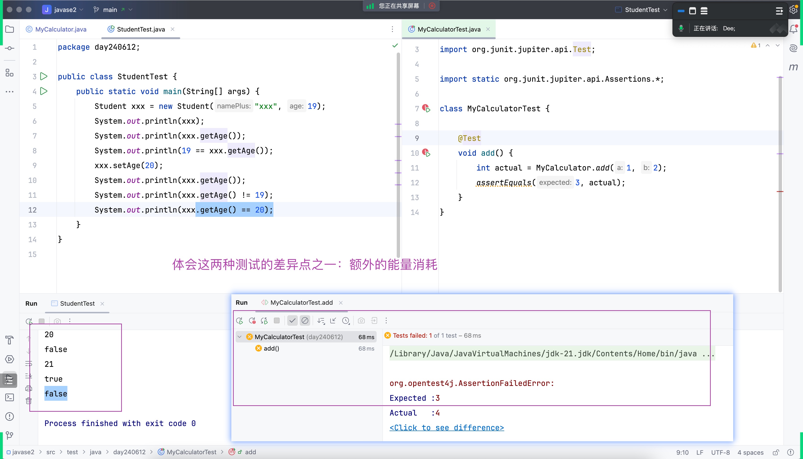
- 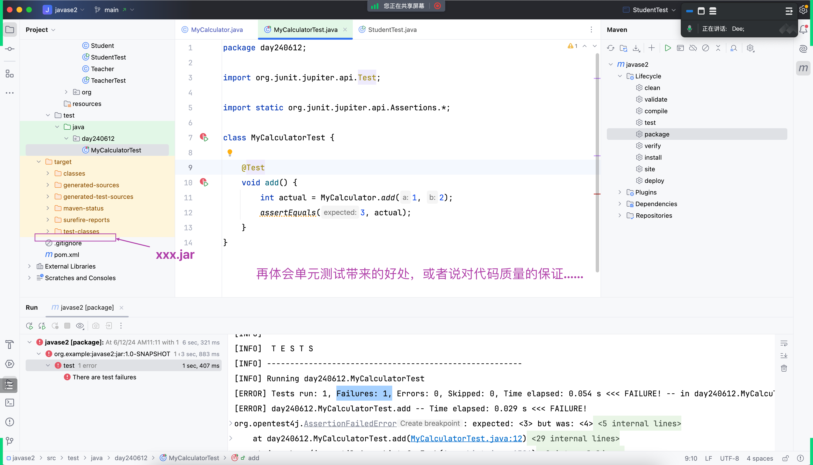
- 
- 
- asserEquals()
  - 
- 时间上的消耗不一样
  - 
  - 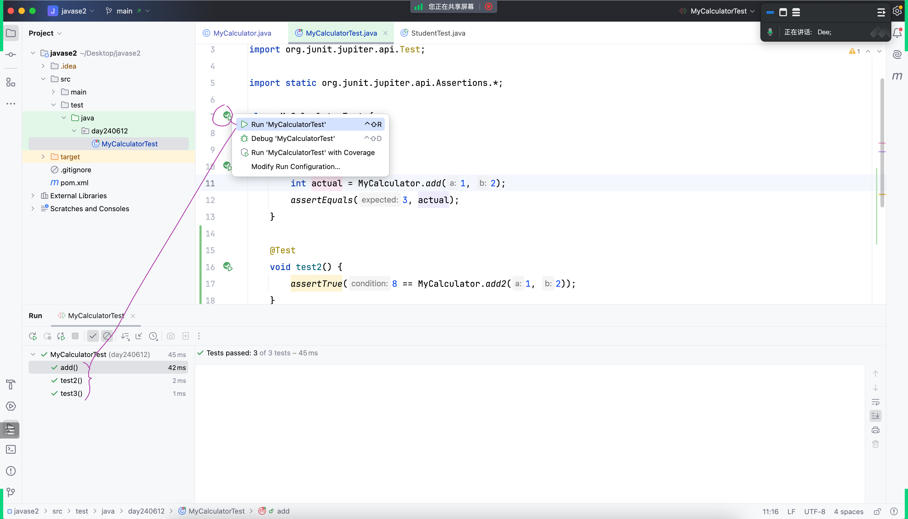
- .jar 包不会生成
  - 
- 融入一些思想
  - 以终为始

### Maven Phases
- 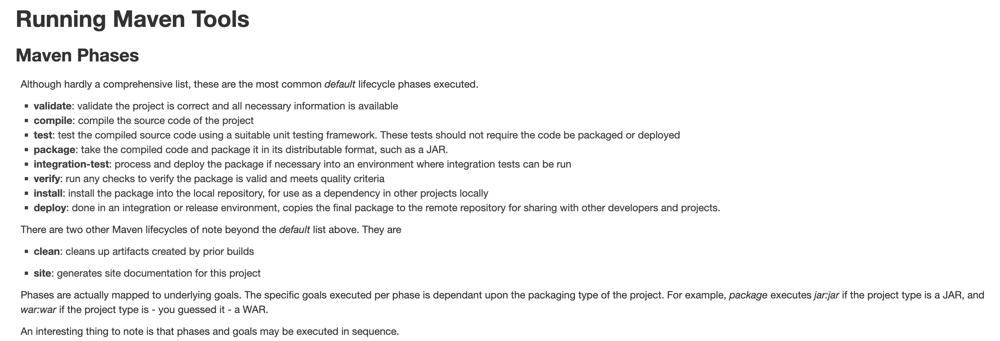
- 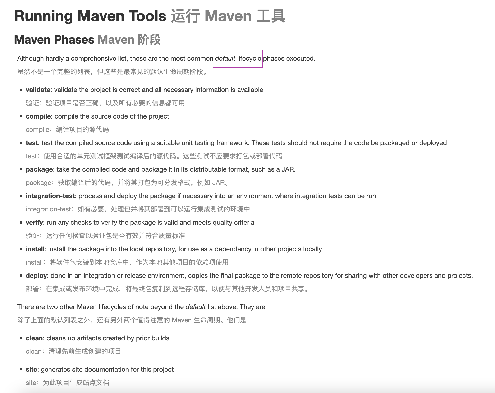

### 储存
- 内存
- 文件
- 专业的存储软件

### 主流数据库软件
- 排名 : https://db-engines.com/en/ranking
- 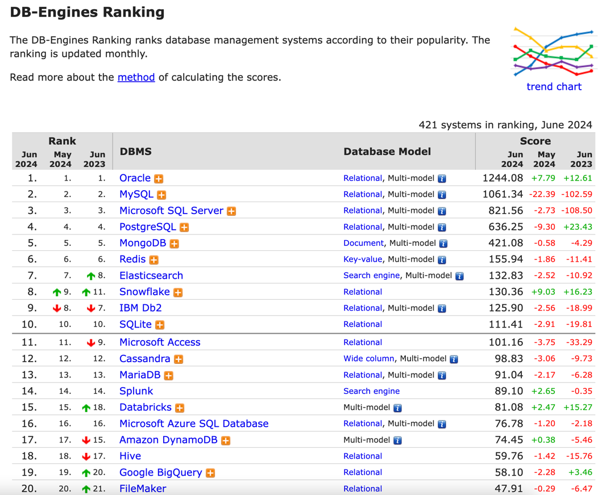

### MySQL
- 官网 : https://www.mysql.com/
- 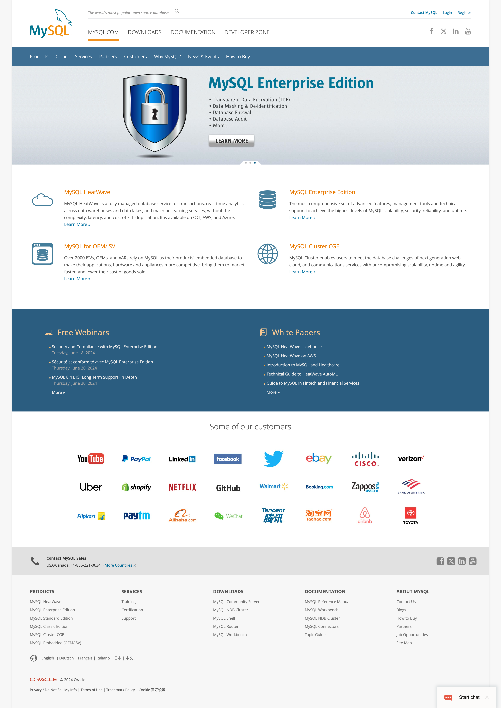
- 下载 MySQL
  - 
  - MySQL Community (GPL) Downloads
    - Windows: MySQL Installer for Windows
    - 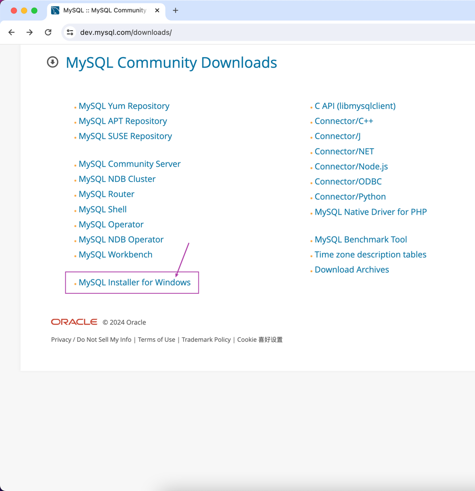
    - 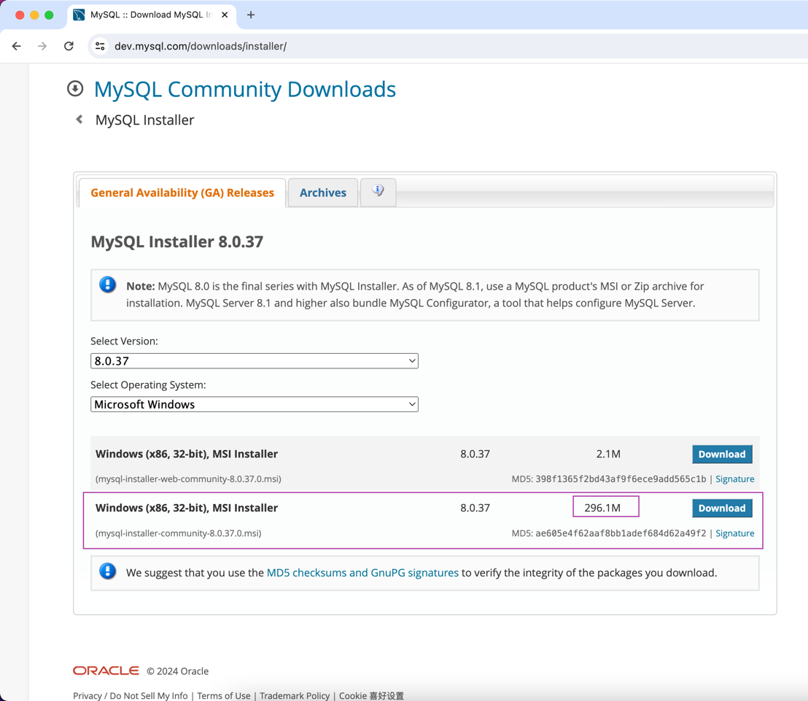
  - No thanks, just start my download.
  - 
  - 下载完应该做校验
    - 
    - 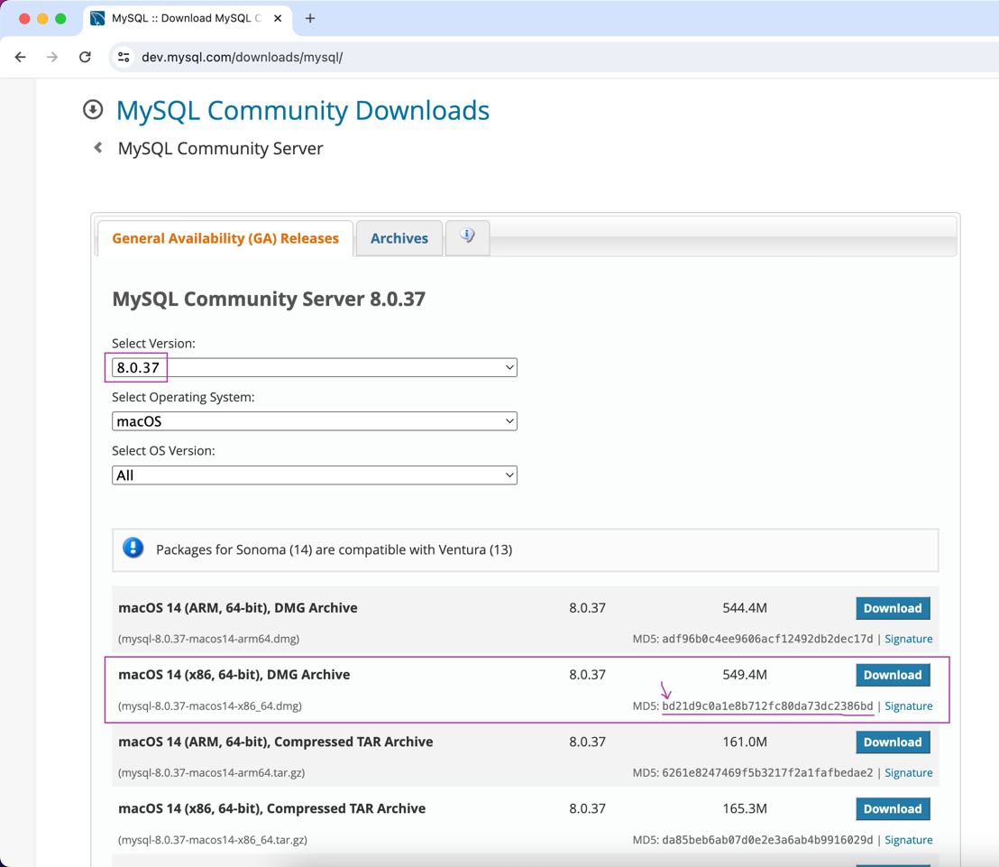
    - for windows: certutil -hashfile filename MD5
      for Linux: md5sum filename
      for macOS: md5 mysql-8.0.37-macos14-x86_64.dmg
    - Windows : certUtil -hashfile filename MD5
  - 我的路径
    - 
- 什么是 MySQL
  - 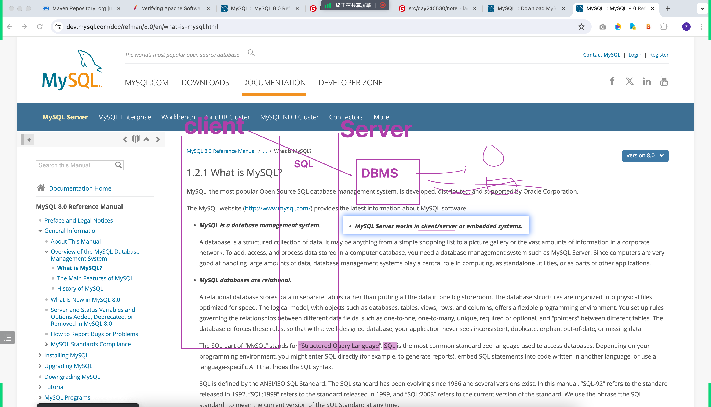
  - 
  - MySQL is a database management system
    /usr/local/mysql/bin/mysql -uroot -psecret
    /usr/local/mysql/bin/mysql -uroot -p
    MySQL databases are relational
    MySQL software is Open Source
    The MySQL Database Server is very fast, reliable, scalable, and easy to use
    MySQL Server works in client/server or embedded systems
    ...
- MySQL 的发音
  - 

#### The Main Features of MySQL
- https://dev.mysql.com/doc/refman/8.0/en/history.html
#### History of MySQL
- https://dev.mysql.com/doc/refman/8.0/en/history.html
- MySQL is named after co-founder Monty Widenius's daughter, My.

### Connecting to and Disconnecting from the Server
  - https://dev.mysql.com/doc/refman/8.0/en/connecting-disconnecting.html
  - 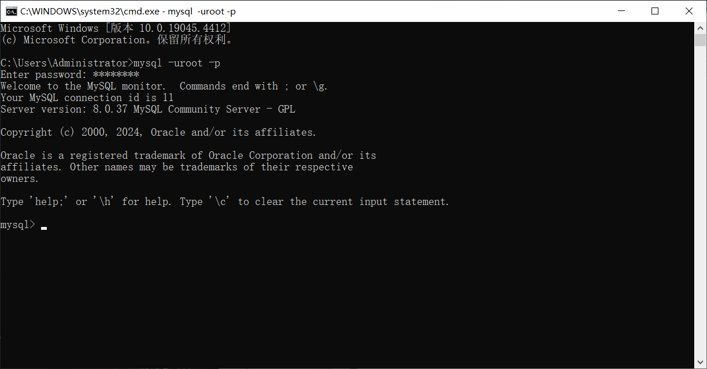

### Entering Queries
- SELECT VERSION(), CURRENT_DATE;

### SQL
The SQL part of “MySQL” stands for “Structured Query Language”.

SQL is the most common standardized language used to access databases. Depending on your programming environment, you might enter SQL directly (for example, to generate reports), embed SQL statements into code written in another language, or use a language-specific API that hides the SQL syntax.

SQL is defined by the ANSI/ISO SQL Standard. The SQL standard has been evolving since 1986 and several versions exist. In this manual, “SQL-92” refers to the standard released in 1992, “SQL:1999” refers to the standard released in 1999, and “SQL:2003” refers to the current version of the standard. We use the phrase “the SQL standard” to mean the current version of the SQL Standard at any time.

#### 注释
- `# 单行注释`
- `-- 单行注释 (要求：第二个破折号后面至少有一个空格或控制字符)`
- `/* 多行注释 */`
#### SQL 分类
- DDL: Data definition language
  https://dev.mysql.com/doc/refman/8.0/en/glossary.html#glos_ddl
- DML: Data manipulation language
  https://dev.mysql.com/doc/refman/8.0/en/glossary.html#glos_dml
- DCL: Data control language
  https://dev.mysql.com/doc/refman/8.0/en/glossary.html#glos_dcl

##### DDL (数据库操作)
- 查询
  - show databases; -- 查询所有数据库
- 使用
  - use 数据库名; -- 使用数据库
- 创建
  - create database [if not exists] 数据库名; -- 创建数据库
  - MySQL 最终还是存储到文件系统中
    - 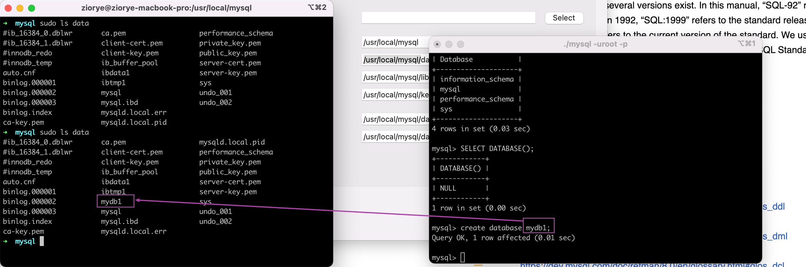
- 删除
  - drop database [if exists] 数据库名; -- 删除数据库
> `database` <-> `schema`

#### DDL (表操作)
-- 创建表
create table 表名(
字段1 字段类型 [约束] [comment 字段1注释],
...
字段n 字段类型 [约束] [comment 字段n注释]
)[comment 表注释];

```sql
create table demo_user
(
  id       int comment 'ID, 唯一标识，主键，自动递增',
  username varchar(20) comment '用户名',
  name     varchar(10) comment '姓名',
  age      int comment '年龄',
  gender   char(1) comment '性别：男、女、中'
) comment '用户表';
```

- 约束
  - 非空约束 not null
  - 唯一约束 unique
  - 主键约束 primary key
  - 默认约束 default
  - 外键约束 foreign key

```sql
create table demo_user
(
  id       int primary key auto_increment comment 'ID, 唯一标识，主键，自动递增',
  username varchar(20) not null unique comment '用户名',
  name     varchar(10) not null comment '姓名',
  age      int comment '年龄',
  gender   char(1) default '男' comment '性别：男、女、中'
) comment '用户表';
```

`auto_increment`


### MySQL 常见数据类型
#### 数值类型
https://dev.mysql.com/doc/refman/8.0/en/integer-types.html

#### 字符类型
https://dev.mysql.com/doc/refman/8.0/en/char.html

#### 日期时间类型
https://dev.mysql.com/doc/refman/8.0/en/date-and-time-types.html

https://dev.mysql.com/doc/refman/8.0/en/date-and-time-type-syntax.html
A timestamp. The range is '1970-01-01 00:00:01.000000' UTC to '2038-01-19 03:14:07.999999' UTC.
TIMESTAMP values are stored as the number of seconds since the epoch ('1970-01-01 00:00:00' UTC).

### MySQL 课堂练习
- 
- `ref: demo.sql`

## JDBC 初见
Java 连接到 MySQL 数据库，并执行简单的查询和插入操作
- 


### Maven 之 生命周期
- 

### 多视角看代码
- .java
- .class