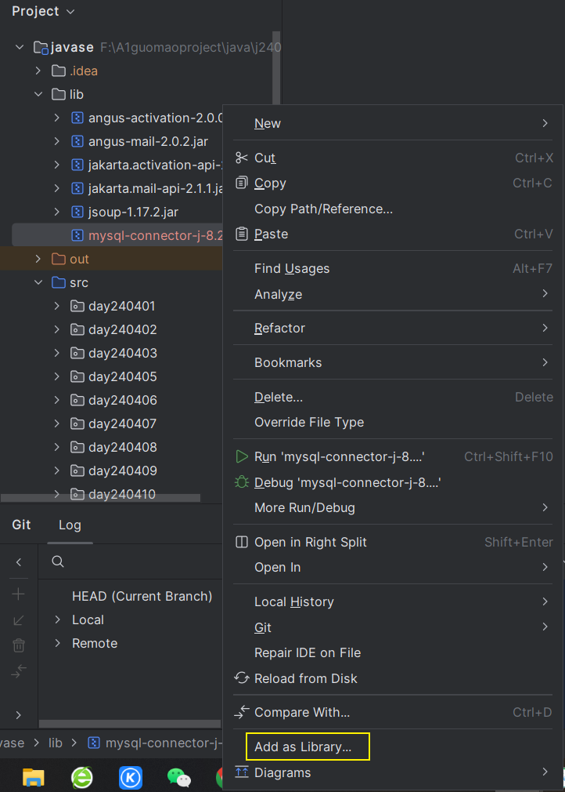
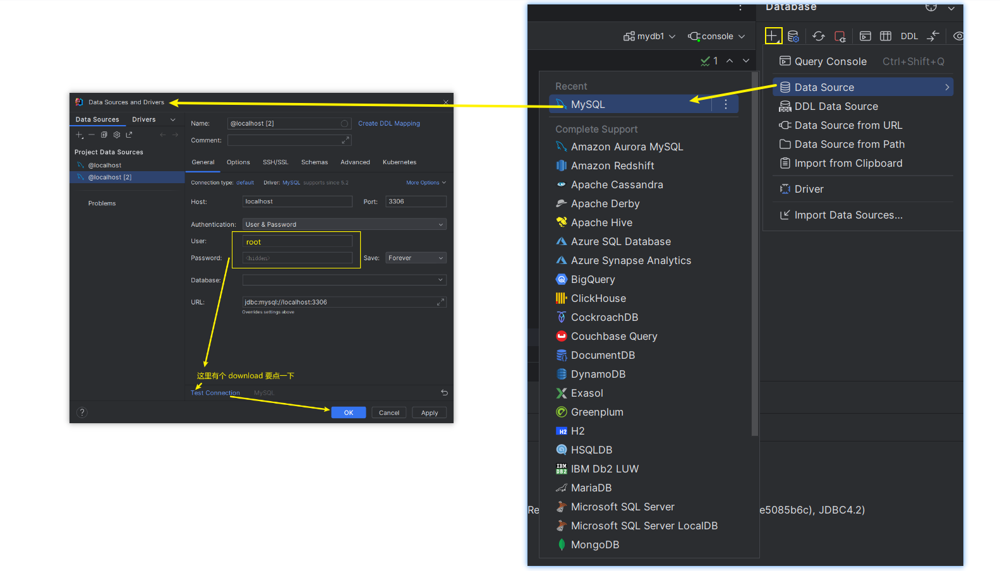
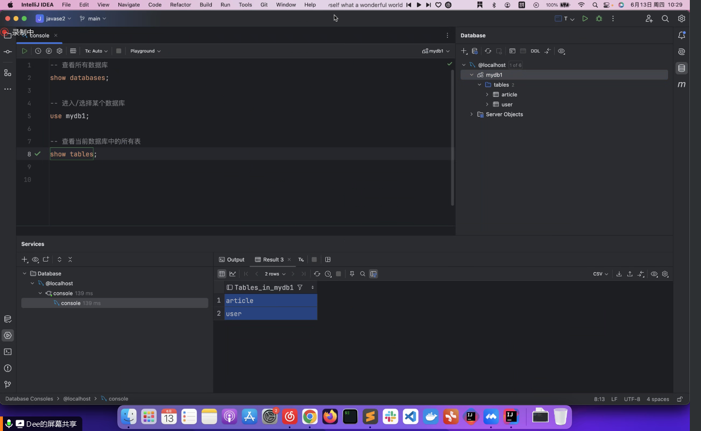
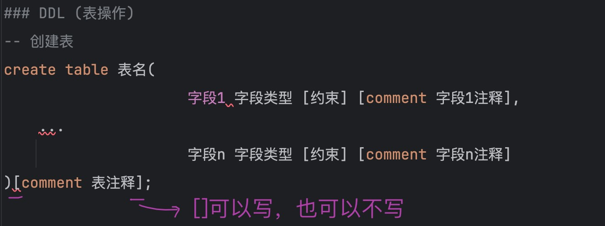

# Note 240613

## Review
- 怎么导 .jar 包
  - 

### 在 idea 中 使用 Database
- 导入
  - 
- 原理: 
  - 
- 创建表
  - 
- 探索
  - https://dev.mysql.com/doc/refman/8.0/en/tutorial.html

### 聚合函数
- 结果就是个值

### having
- 分组完,再次过滤

### SQL 语句
- 查询所有数据库
  - show databases;

- 创建数据库
  - create database if not exists demo;

- 删除某表
  - drop table students;

- 使用/进入指定的数据库
  - use demo;

- 查看: 当前数据库下的表
  - show tables;
- DDL
  - DDL : 表结构
    创建: 基本语法
    create table demo_table(
                            id int comment 'ID, 唯一标识',
                            field1 varchar(20) comment 'field1 注释',
                            field2 varchar(10) comment 'field2 注释',
                            field3 int comment 'field3 注释'
    ) comment '表注释';
    - 例:
      - 创建: 基本语法 (约束)
        - create table demo_user(
          id int primary key auto_increment comment 'ID, 唯一标识，主键，自动递增',
          username varchar(20) not null unique comment '用户名',
          name varchar(10) not null comment '姓名',
          age int comment '年龄',
          gender char(1) default '男' comment '性别：男、女、中'
          ) comment '用户表';

  - 查看: 查看指定表结构
    - describe demo_user;

  - 查看: 数据库的建表语句
    - show create table demo_user;

  - DDL: 修改表结构
    - 修改: 为表 students 添加字段 hometown varchar(11)
      - alter table students add hometown varchar(11) comment '家乡';

    - 修改: 修改 students 字段类型 hometown varchar(13)
      - alter table students modify hometown varchar(13) comment 'hometown';

    - 修改: 修改 students 字段名 hometown 为 hometown2 varchar(13)
      - alter table students change hometown hometown2 varchar(13) comment 'hometown';

    - 修改: 删除 students 的 hometown2 字段
      - alter table students drop column hometown2;

    - 修改: 将 students 表名修改为 student
      - rename table students to student;
      - rename table student to students;

- DML
  - -- DML : 更新数据 - update
    - -- 1. 将 students 表的 ID 为 1 学生 username 字段更新为 '大Y'
      - update students set username = '大Y', updated_at = now() where id = 1;

    - -- 2. 将 students 表的所有学生的入职日期更新为 '2024-03-01'
       - update students set updated_at = now();

  - -- DML : 删除数据 - delete
    - -- 1. 删除 students 表中 ID为1的
      - delete from students where id = 1;
  
    - -- 2. 删除 students 表中的所有学生
      - delete from students;
  
    - -- 3. 清空 students 表数据，同时重置自增值
      - truncate table students;
  - 查询语法
    - -- 查询语法
      /*
      select
      字段列表
      from
      表名列表
      where
      条件列表
      group by
      分组字段列表
      having
      分组后条件列表
      order by
      排序字段列表
      limit
      分页参数
      */

  - 插入语法
    - INSERT INTO 表名(字段) values(值)
  - 排序查询
    - -- 排序条件 asc/desc 默认升序
    - order by 字段 asc/desc
  - 聚合函数
    - as 对查询的东西起个别名
    - count()
      - 查询个数
    - avg()
      - 查询平均值
    - min()
      - 查询最小值
    - max()
      - 查询最大值
    - sum
      - 查询 和值
  - 分组
    - group by
    - having
      - 在分组之后再进行过滤
    - 我的理解 :设计要显示的属性值
    -  函数: case when ... then ... when ... then ... else ... end
    -  函数: case ... when ... then ... when ... then ... else ... end
    