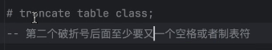
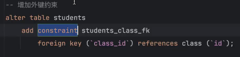
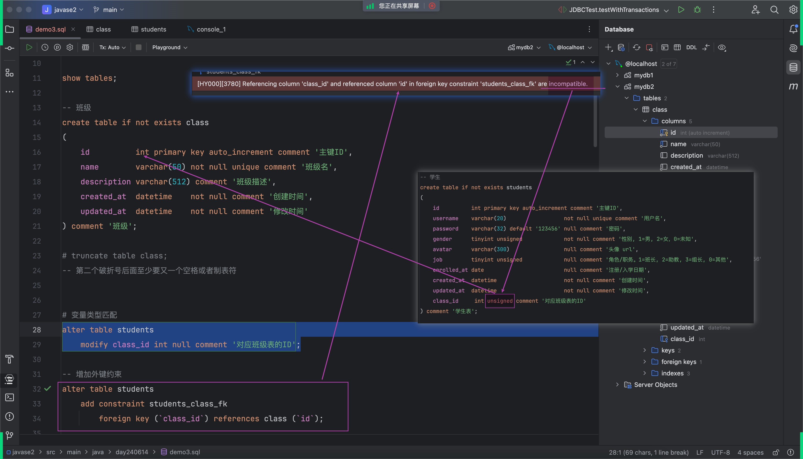
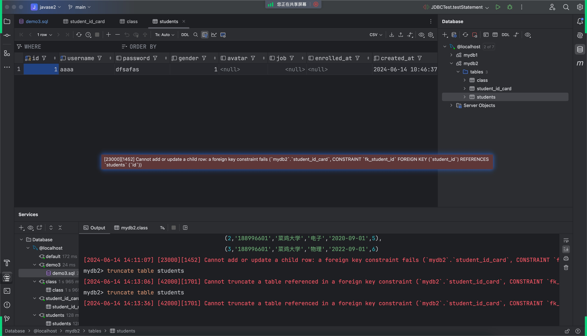
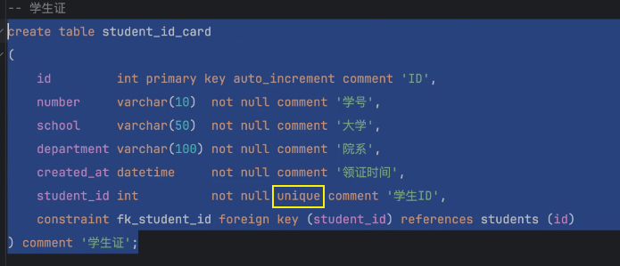
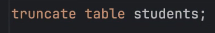
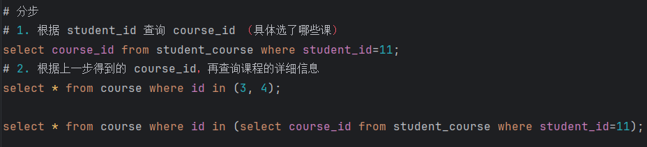
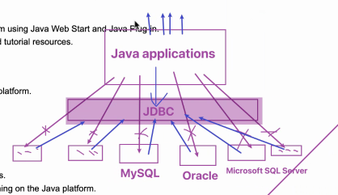
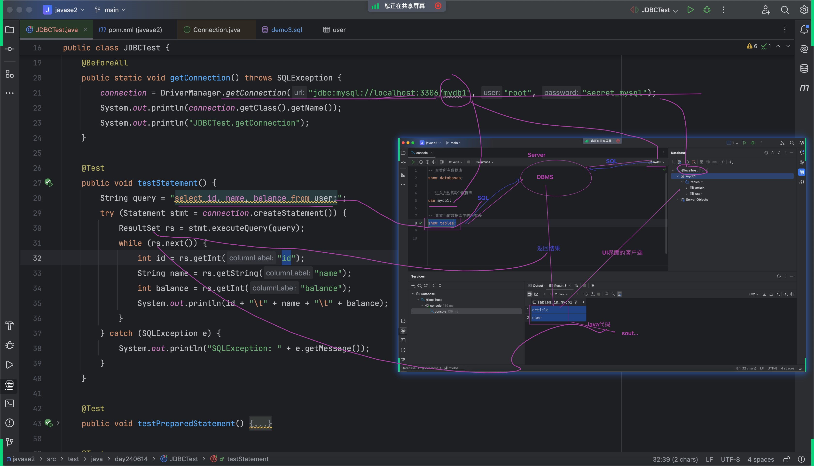
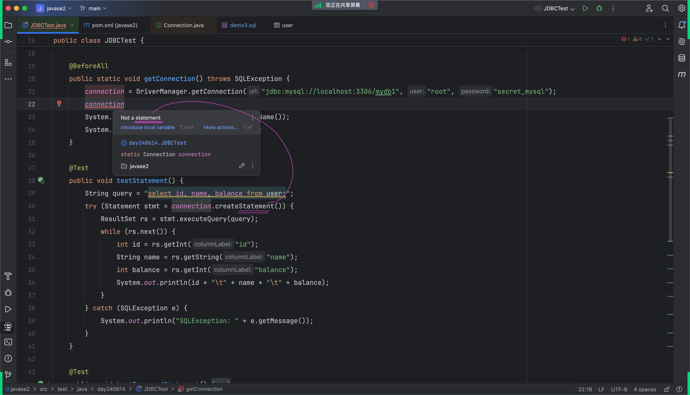

# Note 240614

## Review

### sql 的注释
- 

### 外键
- 
- 数据类型要一样
- 
- 使用 truncate 删除 提醒的报错
  - 
  - 
### 关系
- 一对一
  - 关键字 unique
    - 唯一
      - 
- 一对多
- 多对多

### truncate
- 清除所有
  - 

### constraint  
- 用于定义或强制实施某些规则，以保证数据的准确性和完整性。这些规则被称为约束（Constraints）。约束可以在创建表（CREATE TABLE）或修改表（ALTER TABLE）时定义。
- PRIMARY KEY
  - 主键约束，用于唯一标识表中的每一行。每个表只能有一个主键约束，主键列的值必须是唯一的，不能为 NULL。
- UNIQUE
  - 唯一约束，用于保证列中的所有值都是唯一的。
- FOREIGN KEY
  - 外键约束，用于防止在两个表之间创建无效的数据。这可以确保引用的数据存在于另一个表中。
- CHECK
  - 检查约束，用于限制列中的值的范围。这可以确保列中的数据满足特定的条件。
- NOT NULL
  - 非空约束，用于确保列不能有 NULL 值。

### in
- 在查询的结果的基础上再查
- 

### JDBC
- 目的: 链接各种数据库
- 定义规范与协议
  - 高以下为基
    - 强者只制定规则
- 
- 细则
  - 查询
    - Connection
    - Statement
    - ResultSet
    - 
    - 占位符
  - 插入
  - 更新
  - 删除
      - 回滚

### 注解 @BeforeAll
- 在 Java 中，@BeforeAll 是 JUnit 5 中的一个注解，它用来标记一个方法应该在当前测试类中的所有测试之前执行。与 @BeforeEach 不同的是，@BeforeAll 注解的方法只会被执行一次。
- 这对于一些需要在所有测试开始之前进行的初始化操作非常有用，例如设置静态资源、打开数据库连接等。

### Statement
- 语句
- 