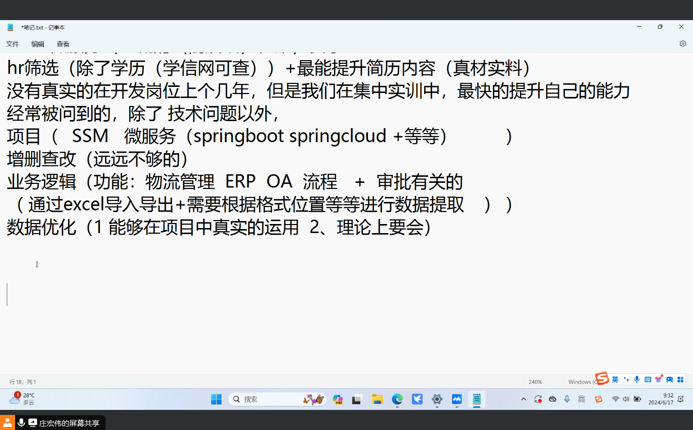
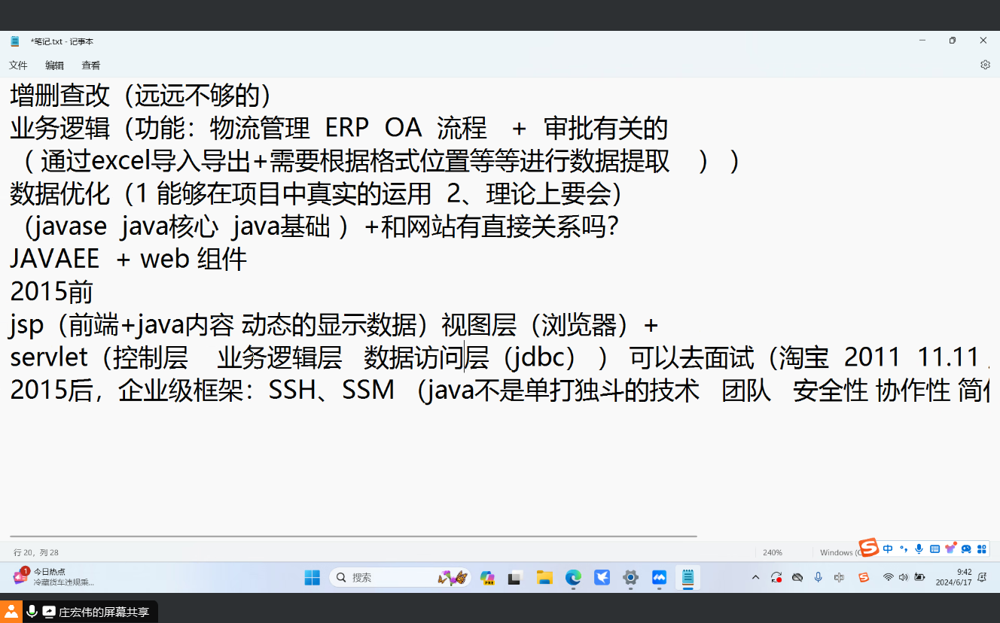
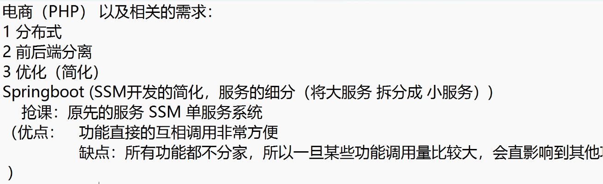
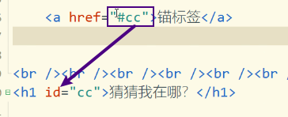

# Note 240617

## Review

### 截图寄存处
- 
- 
- 

### SSH
- Spring + Struts2 + hibernate (ORM 对象关系映射 , SQL -> HQL)

### SSM
- Spring + SpringMVC + mybatis (半ORM sql语句)

### Springboot
- SSM 开发的简化 , 服务的细分 (将大服务 拆分成 小服务)
- 单服务系统
    - 优点: 功能直接的互相调用方便
    - 缺点: 所有功能都不分家,一旦某些功能调用量比较大,会直接影响其他功能

### SpringCould
- 服务注册
- 网关负载均衡

### JavaEE web组件
- 前端知识点 （静态的，数据并非来至后台服务器）
  - html css js jq + 前端框架 bootcss 、 layUI 、 VUE + element
  - jsp （前端 + Java知识点 （可以获得来自后台的数据）） + servlet （动态数据 、 浏览器访问服务器）
  - 前后端分离 （vue（结合到静态知识点） （不再涉及 Java 代码 （前端工程师不用学习Java ， 后端工程师可以不用学习前端的知识）））

### 前端软件：
- text文档
- vs code （未来常用）
- Hbuilder （适合新手）

### Hbuilder
- 注释快捷键
  - `<!-- `ctrl + shift + /` 注释的快捷键 -->`

### HTML
- 超文本标记性语言
  - Hyper Text Markup Language
- 标签
  - 普通标签 : 有开始有结束
    - 块标签 : 独立成行
      - 标题 `h1 ~ h6`
        - 特性 : 数字越大 字越小 加粗 独立成行(块元素/块标签)
          - 一级标题 `<h1></h1>`
          - 二级标题 `<h2></h2>`
          - ...
          - 六级标题 `<h6></h6>`
      - 段落标签 `

`
    - 行内标签 : 可以和其他行内标签和文字共享一行
      - 加粗 
        - `<b></b>`
        - `<Strong></Strong>`
      - 斜体标签
        - `<i></i>`
        - `<em></em>`
      - 斜体标签 `<i></i>`
      - 下划线标签 `<u></u>`
      - 删除线标签 `<s></s>`
      - 超链接 ``
        - 路径
          - 绝对路径
            - 具体的盘底下的
              - C:\user\...
          - 相对路径
            - 相对于当前的文件
            - `../` 上级文件
        - target 属性
          - 默认是当前页打开 
            - `<a href="index.html" target="_blank">index(打开方式：空白页打开)</a>`
            - `<a href="index.html" target="_self">index(打开方式：本页中打开)</a>`
        - 锚标签 
          - (本页中跳转: 本页中跳转:指定的标签(给指定的标签配上属性id),让它显示在浏览器当前位置)
          - href 内容是就是指定标签的id值前缀 是 #
            - 
    - 属性 和 内容 
      - 超链接 `<a (属性) href="要跳转的路径">(内容)</a>`
  - 自闭合标签 `<**/>`
    - 块标签
      - 换行 ` `
      - 水平线标签 `
`
- 转义字符
  - 转移字符的书写规范 : &字符;
    - 空格 `&nbsp;`
      - 一个空格符 占半个字符 , 四个相当于一个中文
    - 小于号 `&lt;`
    - 大于号 `&gt;`
    - 其余的就不用记了
- 特殊的写法
  - 平方的写法
    - ``
  - 数字的下标
    - ``
    - 比如 化学方程式 : H2O(水 一氧化二氢)

### 范围外部网站
- 要加 https://

### 路径
- 绝对路径
  - 具体的盘底下的
    - C:\user\...
- 相对路径
  - 相对于当前的文件
    - `../` 上级文件